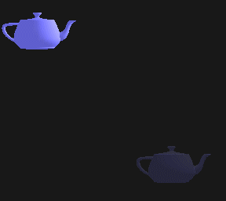
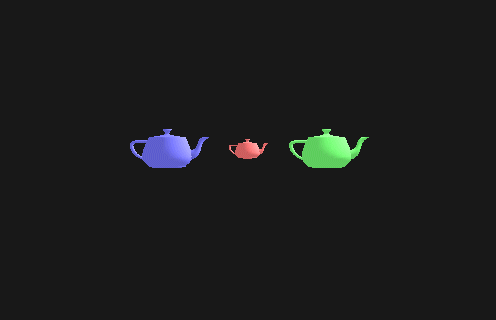
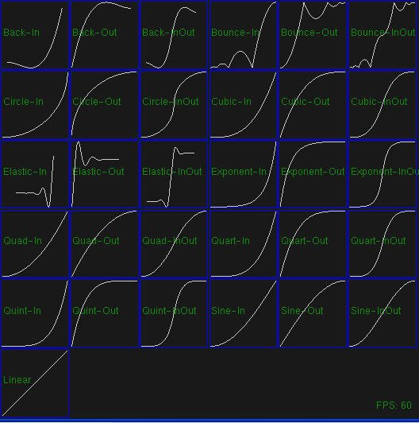

# cpgf tween library

<!-- toc -->

- [Main features](#main-features)
- [Time unit in cpgf tween library](#time-unit-in-cpgf-tween-library)
- [Common types, methods and parameters in both GTween and GTimeline](#common-types-methods-and-parameters-in-both-gtween-and-gtimeline)
- [GTween special methods and parameters](#gtween-special-methods-and-parameters)
- [GTimeline special methods](#gtimeline-special-methods)
- [Use GTweenList](#use-gtweenlist)
- [Drive the tween](#drive-the-tween)
- [Tweening large amount of properties at once in CPU data cache friendly manner](#tweening-large-amount-of-properties-at-once-in-cpu-data-cache-friendly-manner)
- [Use the sample application](#use-the-sample-application)

<!-- tocstop -->

cpgf tween and timeline library is a powerful tweening engine written in pure C++. A tween interpolates property values overtime in-between a certain duration. A timeline manages a sequence of tweens or nested timelines.

We can do lots of stuff with cpgf tween library, such as, but not limit to,
  * Create tween animation in game or media software, similar as we did in Adobe Flash with ActionScript.
  * Create visual user interface effect in application software, similar as the drag and drop effect in IOS and Android devices.
  * Delay call a function after a certain duration.

## Main features

  * Support many features that exist in some other widely used Flash tweening engines such as TweenMax. cpgf tween library supports repeat, yoyo, delay, repeat delay, backward, use frames, time scale, dynamical destination value (follow), and a lot of callbacks on initialization or complete.
  * Support many easing functions. Now supports back, bounce, circle, cubic, elastic, exponent, linear, quad, quart, quint (strong), and sine. Adding new easing functions is a piece of cake!
  * Support unlimited property types to tween on. With the powerful generic template programming, any types can be tweened as long as the type supports operators T + T, T - T, and T * float.
  * Support tweening getter and setter functions. With the powerful cpgf accessor library, we can tween a property via either direct address access, or getter and setter functions.
  * Flexibility and extensibility. Not only can we add any new easing functions and tween different property types, but also we can tween a bunch of properties in CPU data cache friendly manner.
  * Support both tween and timeline. A timeline is a "super" tween which can contains other tweens and timelines.

<WRAP tip>
To learn from real projects using or samples, check my 2D game engine that uses cpgf tweening library a lot.

[]()
</WRAP>


The code snippet below shows how a tween looks like. A tween moves a sprite to new position x=100, y=200, with elastic ease, in 2 time units.
```c++
// Define a sprite somewhere.
FooSprite mySprite;

// Setup the tween
GTween & tween = GTweenList::getInstance()->createTween()
  .duration(2.0f)
  .ease(ElasticEase::easeIn())
  
  // We can use getter/setter functions
  .target(createAccessor(&mySprite, &FooSprite::getX, &FooSprite::setX), 100)
  
  // We can also use property address directly, as long as the property is public.
  .target(createAccessor(&mySprite, &FooSprite::y, &FooSprite::y), 200)
;

// The main tick function
void gameLoop(float frameDuration)
{
  GTweenList::getInstance()->tick(frameDuration);
}
```

Below animation shows how cpgf tween library works. A teapot moves with bounce-out ease, repeatedly, in 2 seconds.


Below animation shows how timeline works. Three teapots moves in different ease animation, one by one.


## Time unit in cpgf tween library

cpgf tween library supports two kinds of timing mode
  * One mode is frame based (useFrames(true)). In each tick the time is forwarded by 1. So a duration 10 will be finished in 10 frames, no matter what the frame rate is.
  * The other mode is time based (useFrames(false)). In each tick the time is forwarded by frameDuration which passed in. Unlike a lot of other tweening engines, cpgf tween library doesn't define the time unit. It all depends on how we use it. If we use seconds as duration, we should tick with seconds. If we use milliseconds as duration, so does we call tick().

**Canveat**: if the frameDuration is 0, the timeline will start any pending tweens immediately and cause weird behavior. So only use positive number as frameDuration. If your game frame rate is over 1000 that cause the frame duration is under 1 millisecond, you should use microsecond or even nanosecond which is never goes to zero.


## Common types, methods and parameters in both GTween and GTimeline

Class GTween and GTimeline share a lot of types, methods and parameters in common. Below lists the methods and parameters. Note either tween or timeline is also called a tweenable.

GTween is in header "cpgf/tween/gtween.h", GTimeline is in header "cpgf/tween/gtimeline.h". And they are in namespace "cpgf".

Types
```c++
typedef float GTweenNumber;
```
The type is used to store and calculate timing duration.
```c++
typedef GCallback<void ()> GTweenCallback;
```
The callback type.

Parameter setting functions
```c++
GTween(Or GTimeline) & backward(bool value);
```
Default is false. If the value is true, the tweenable will start from end to beginning. The function returns a reference to current object. So we can write chain functions as we did in above sample code.
```c++
GTween(Or GTimeline) & useFrames(bool value);
```
Default is false. If the value is true, the timing mode will be frame based. If the tweenable is in a master timeline, this value is always overwritten by the master timeline.
```c++
GTween(Or GTimeline) & delay(GTweenNumber value);
```
Default is 0. Set the delay time. The tweenable will start after the value of time is elapsed.
```c++
GTween(Or GTimeline) & timeScale(GTweenNumber value);
```
Default is 1. This value is multiplied to frame duration to change the tweenable speed. 1 is the normal speed, 0.5 is half speed, 2.0 is double speed, etc.
```c++
GTween(Or GTimeline) & repeat(int value);
```
Default is 0. Set the number of times that the tweenable should repeat. -1 or tweenRepeatInfinitely repeats infinitely, 0 or tweenNoRepeat doesn't repeat.
```c++
GTween(Or GTimeline) & repeatDelay(GTweenNumber value);
```
Default is 0. Set the delay time between repeats.
```c++
GTween(Or GTimeline) & yoyo(bool value);
```
Default is false. If the value is true, the tweenable will go back and forth, appearing to reverse every other cycle.
```c++
GTween(Or GTimeline) & onInitialize(const GTweenCallback & value);
```
Set the callback which is called when the tweenable initializes. A tweenable will initialize after the delay time is elapsed and before the first tick.
```c++
GTween(Or GTimeline) & onComplete(const GTweenCallback & value);
```
Set the callback which is called when the tweenable completes.
```c++
GTween(Or GTimeline) & onDestroy(const GTweenCallback & value);
```
Set the callback which is called when the tweenable object is going to be freed.
```c++
GTween(Or GTimeline) & onUpdate(const GTweenCallback & value);
```
Set the callback which is called when the tweenable applied the new value in each tick.
```c++
GTween(Or GTimeline) & onRepeat(const GTweenCallback & value);
```
Set the callback which is called when the tweenable is going to repeat.

Status query functions
```c++
bool isRunning() const;
bool isPaused();
bool isCompleted() const;
bool isUseFrames() const;
bool isBackward() const;
bool isYoyo() const;
bool isRepeat() const;
bool isRepeatInfinitely() const;
int getRepeatCount() const;
GTweenNumber getRepeatDelay() const;
GTweenNumber getDelay() const;
GTweenNumber getTimeScale() const;
```

Functions
```c++
void tick(GTweenNumber frameDuration);
```
Step forward the time.
```c++
void pause();
```
Pause the tweenable.
```c++
void resume();
```
Resume the tweenable.
```c++
void immediateTick();
```
Tick the tweenable immediately. This is usually called after the tweenable is setup and before starting. Calling this function will set the properties to the start value.
```c++
virtual void restart();
```
Restart the tweenable. Any delay time is not included. So the tweenable will start without any delay time.
```c++
virtual void restartWithDelay();
```
Restart the tweenable and include any delay time.
```c++
GTweenNumber getCurrentTime() const;
```
Get current elapsed time, not including delay time or any repeat.
```c++
void setCurrentTime(GTweenNumber value);
```
Set current elapsed time, not including delay time or any repeat. In next tick, the tweenable will update from the new time.
```c++
GTweenNumber getTotalTime() const;
```
Get overall elapsed time, not including delay time, but include repeat and repeat delay time.  
If the tweenable is repeating infinitely, the return value is meaningless.
```c++
void setTotalTime(GTweenNumber value);
```
Set overall elapsed time, not including delay time, but include repeat and repeat delay time.  
If the tweenable is repeating infinitely, setting the total time is undefined behavor.
```c++
GTweenNumber getCurrentProgress() const;
```
Get current elapsed progress, not including delay time or any repeat. This is same as  *return getCurrentTime() / getDuration();*  
The return value is always between [0, 1].
```c++
void setCurrentProgress(GTweenNumber value);
```
Set current elapsed progress, not including delay time or any repeat. This is same as  *setCurrentTime(value * getDuration());*  
The value should be always between [0, 1]. If the value is smaller than 0, 0 will be used. If the value is larger than 1, 1 will be used.
```c++
GTweenNumber getTotalProgress() const;
```
Get overall elapsed progress, not including delay time, but include repeat and repeat delay time. This is same as  *return getTotalTime() / getTotalDuration();*  
The return value is always between [0, 1].  
If the tweenable is repeating infinitely, the return value is meaningless.
```c++
void setTotalProgress(GTweenNumber value);
```
Set overall elapsed progress, not including delay time, but include repeat and repeat delay time. This is same as  *setTotalTime()(value * getTotalDuration());//  
The value should be always between [0, 1]. If the value is smaller than 0, 0 will be used. If the value is larger than 1, 1 will be used.  
If the tweenable is repeating infinitely, setting the total progress is undefined behavor.
```c++
virtual GTweenNumber getDuration() const = 0;
```
Get the duration of the tweenable. The duration doesn't include any delay or repeat.
```c++
GTweenNumber getTotalDuration() const;
```
Get the total duration of the tweenable. The total duration doesn't include any delay, but include repeat and repeat delay time.  
If the tweenable is repeating infinitely, the return value is meaningless.
```c++
virtual void removeForInstance(const void * instance) = 0;
```
Remove all properties which object equals to the instance.

## GTween special methods and parameters

Parameter setting functions
```c++
GTween & ease(const GTweenEaseType & ease);
```
Set the ease function. Default is LinearEase::ease().
```c++
GTween & duration(GTweenNumber durationTime);
```
Set the duration time. The duration doesn't include any delay time or repeat delay.

Functions
```c++
template <typename AccessorType>
GTween & target(const AccessorType & accessor,
    const typename AccessorType::ValueType & targetValue);

template <typename AccessorType>
GTween & target(const AccessorType & accessor,
    const typename AccessorType::ValueType & from,
    const typename AccessorType::ValueType & targetValue);
```
Add a property to tween on.  
accessor: An accessor that the tween uses to get and set value. We can call global function createAccessor to create the accessor. Please reference to the accessor documentation for details. In the second overload function, since we specified the "from" value, the accessor could only have setter and without getter.  
targetValue: The target value. The property value will be tweened to the target value.  
from: Specify the beginning value. Otherwise with the first function, GTween will use the property value at the time when the tween starts.
```c++
template <typename AccessorType>
GTween & relative(const AccessorType & accessor,
    const typename AccessorType::ValueType & relativeValue);

template <typename AccessorType>
GTween & relative(const AccessorType & accessor,
    const typename AccessorType::ValueType & from,
    const typename AccessorType::ValueType & relativeValue);
```
Similar as the "target" functions. The "relative" functions add a property to tween on. Instead of setting any target value, "relative" sets relative value, which will be added to the property value when the tween starts.
```c++
template <typename AccessorType, typename TargetGetterType>
GTween & follow(const AccessorType & accessor,
    const TargetGetterType & targetGetter);

template <typename AccessorType, typename TargetGetterType>
GTween & follow(const AccessorType & accessor,
    const typename AccessorType::ValueType & from,
    const TargetGetterType & targetGetter);
```
Similar as the "target" functions, the "follow" functions add a property to tween on. The target value will be retrieved from targetGetter dynamically. We can use createGetter to create the target getter.

## GTimeline special methods
```c++
GTween & tween();
```
Create a tween. The timeline will own the new created tween. The tween is not on the timeline until functions append, prepend, insert, or setAt are called.
```c++
GTimeline & timeline();
```
Create a timeline. The timeline will own the new created timeline. The new created timeline is not on the timeline until functions append, prepend, insert, or setAt are called.
```c++
GTweenNumber append(const GTweenable & tweenable);
```
Append the tweenable to the timeline. If there is already 8 time units in the timeline, tweenable will start from 8th time units.  
The function returns the start time of the tweenable.  
Note the tweenable must be owned by the timeline, or to say, must be created by tween() or timeline() of the timeline.
```c++
void prepend(const GTweenable & tweenable);
```
Insert the tweenable to the beginning of the timeline. The tweenable will always start from 0th time unit. All other tweenables on the timeline will be pushed back.  
Note the tweenable must be owned by the timeline, or to say, must be created by tween() or timeline() of the timeline.
```c++
void insert(GTweenNumber time, const GTweenable & tweenable);
```
Insert the tweenable at the "time" of the timeline. The tweenable will always start from "time" time unit. All other tweenables which start time is later than or equal to "time" on the timeline will be pushed back.  
Note the tweenable must be owned by the timeline, or to say, must be created by tween() or timeline() of the timeline.
```c++
void setAt(GTweenNumber time, const GTweenable & tweenable);
```
Put the tweenable at the "time" of the timeline. The tweenable will always start from "time" time unit. All other tweenables are not affected.  
Note the tweenable must be owned by the timeline, or to say, must be created by tween() or timeline() of the timeline.
```c++
GTweenNumber getStartTime(const GTweenable & tweenable);
```
Get the start time of a tweenable.
```c++
size_t getTweenableCount() const;
```
Get tweenable count.
```c++
void clear();
```
Clear all tweenables.
```c++
void remove(const GTweenable & tweenable);
```
Remove tweenable from the tween list.
```c++
virtual void removeForInstance(const void * instance);
```
Remove all properties which object equals to the instance.

## Use GTweenList

Though we can create objects of GTween and GTimeline and tick them, a better way is to use GTweenList. We can get several benefits by using GTweenList,
  * GTweenList allocates GTween and GTimeline on a memory pool, which is better performace and less memory fragements.
  * GTweenList frees GTween and GTimeline automatically after they are completed.

To use GTweenList, we can create new instance of GTweenList, also we can use the global GTweenList instance by calling GTweenList::getInstance().
```c++
static GTweenList * getInstance();
```
Get the global singleton instance of GTweenList.
```c++
GTween & tween();
```
Create a tween and return the reference. Note either GTween or GTimeline is not copyable.
```c++
GTimeline & timeline();
```
Create a timeline and return the reference.
```c++
void tick(GTweenNumber frameDuration);
```
Step forward the time.
```c++
size_t getTweenableCount() const;
```
Get tweenable count.
```c++
void clear();
```
Clear all tweenables.
```c++
void remove(const GTweenable & tweenable);
```
Remove tweenable from the tween list.
```c++
virtual void removeForInstance(const void * instance);
```
Remove all properties which object equals to the instance.

## Drive the tween

To be most platform independent, cpgf tween library doesn't update each tweens or timelines. It's up to the user to call the function "tick" on GTween, GTimeline, or GTweenList.
```c++
void tick(GTweenNumber frameDuration);
```

**Canveat**: if the frameDuration is 0, the timeline will start any pending tweens immediately and cause weird behavior. So only use positive number as frameDuration. If your game frame rate is over 1000 that cause the frame duration is under 1 millisecond, you should use microsecond or even nanosecond which is never goes to zero.


## Tweening large amount of properties at once in CPU data cache friendly manner

Nowadays CPU data cache friendly is one of the most important optimization skill in high performance software such as console game. It's not rare that we may want to tween thousands of object on the screen in a game. Creating thousands of tweens, and each tween moves only one object, sounds work. But that may cause a lot of data cache misses and cause very bad performance.

Fortunately, with the great extensibility, we can create only one tween and change all objects values in very CPU data cache friendly manner.

Now let's see how this magic works. Let's create one and only one tween first.
```c++
GTween & tween = GTweenList::getInstance()->tween()
  .target(createAccessor(myInstance, 0, &MyClass::setRatio), 0.0f, 1.0f)
  .duration(blah blah)
  //.any other parameters
;
```
The differences with other tweens are,
  * We set the getter as 0 to the accessor. That means the accessor can't get value from the property. That's fine because we passed the "from" value (0.0f).
  * The "from" value is always 0.0f and the "target" value is always 1.0f.

Now let's see how MyClass::setRatio works.
```c++
void MyClass::setRatio(float ratio)
{
}
```

Now we can see the function setRatio receives a parameter of ratio. The tween "thinks" setRatio is a normal setter function and passes the value to it, but since we set the "from" value to 0.0f and "target" value to 1.0f, the value passed from the tween is the ratio between 0 and 1.
Thus we only need to multiply "ratio" to our data cache friendly data structure. For example, if we have a vector that holds a list of positions, we simple multiply ratio with each elements in the vector.
```c++
void MyClass::setRatio(float ratio)
{
  for(Iterator it = myData.begin(); it != myData.end(); ++it) {
    *it *= ratio;
  }
}
```

In the tween sample application, there is test case in testcaseparticles.cpp shows how this works.

## Use the sample application

There is a "tween" folder in cpgf sample directory, which is a comprehensive demonstration of how cpgf tween library works. The sample is a wxWidgets GUI application, and render in OpenGL. It also uses freeglut to draw the teapot.

Below image shows the charts of all ease function in the tween library, rendered by the sample application.

