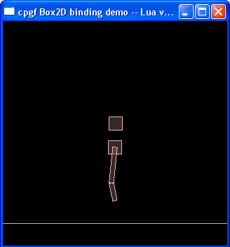

<!--notoc-->

# Built-in meta data for Box2D physics engine in C++ cpgf library

## Overview

The meta data for Box2D is a collection of meta data to represent for Box2D physics engine library.  
Now the supported Box2D version is 2.1.



Can't wait to experiment the Box2D binding? Below is a piece of real Lua code snippet that using Box2D!  
To see more code, including JavaScript code, see samples/bopx2d/samplebox2d.cpp in the library package.
```lua
function setupBox2d()
    	gravity = box2d.b2Vec2(0.0, -10.0)
    	world = box2d.b2World(gravity, 1)
    	bd = box2d.b2BodyDef()
    	ground = world.CreateBody(bd)
    	shape = box2d.b2PolygonShape()
    	shape.SetAsEdge(box2d.b2Vec2(-40.0, 0.0), box2d.b2Vec2(40.0, 0.0))
    	ground.CreateFixture(shape, 0.0)
    	prevBody = ground

    	shape = box2d.b2PolygonShape()
    	shape.SetAsBox(0.5, 2.0)
    	bd = box2d.b2BodyDef()
    	bd.type = box2d.b2_dynamicBody
    	bd.position.Set(0.0, 7.0)
    	body = world.CreateBody(bd)
    	body.CreateFixture(shape, 2.0)
    	rjd = box2d.b2RevoluteJointDef()
    	rjd.Initialize(prevBody, body, box2d.b2Vec2(0.0, 5.0))
    	rjd.motorSpeed = 1.0 * box2d.b2_pi
    	rjd.maxMotorTorque = 10000.0
    	rjd.enableMotor = true
    	m_joint1 = world.CreateJoint(rjd)
    	prevBody = body

    	shape = box2d.b2PolygonShape()
    	shape.SetAsBox(0.5, 4.0)
    	bd = box2d.b2BodyDef()
    	bd.type = box2d.b2_dynamicBody
    	bd.position.Set(0.0, 13.0)
    	body = world.CreateBody(bd)
    	body.CreateFixture(shape, 2.0)
    	rjd = box2d.b2RevoluteJointDef()
    	rjd.Initialize(prevBody, body, box2d.b2Vec2(0.0, 9.0))
    	rjd.enableMotor = false
    	world.CreateJoint(rjd)
    	prevBody = body

    	shape = box2d.b2PolygonShape()
    	shape.SetAsBox(1.5, 1.5)
    	bd = box2d.b2BodyDef()
    	bd.type = box2d.b2_dynamicBody
    	bd.position.Set(0.0, 17.0)
    	body = world.CreateBody(bd)
    	body.CreateFixture(shape, 2.0)
    	rjd = box2d.b2RevoluteJointDef()
    	rjd.Initialize(prevBody, body, box2d.b2Vec2(0.0, 17.0))
    	world.CreateJoint(rjd)
    	pjd = box2d.b2PrismaticJointDef()\n
    	pjd.Initialize(ground, body, box2d.b2Vec2(0.0, 17.0), box2d.b2Vec2(0.0, 1.0))
    	pjd.maxMotorForce = 1000.0
    	pjd.enableMotor = true
    	m_joint2 = world.CreateJoint(pjd)

    	shape = box2d.b2PolygonShape()
    	shape.SetAsBox(1.5, 1.5)
    	bd = box2d.b2BodyDef()
    	bd.type = box2d.b2_dynamicBody
    	bd.position.Set(0.0, 23.0)
    	body = world.CreateBody(bd)
    	body.CreateFixture(shape, 2.0)
    end
```

## Build meta data

The meta data for Box2D library is automatically generated by the tool metagen.  
The header files are in folder include/cpgf/metadata/box2d  
The source files are in folder src/metadata/box2d

To use the meta data, you need to link to all meta_box2d_*.cpp files in source folder.  
To auto register the meta data to global namespace, link to register_meta_box2d.cpp. Box2D will be registered to "box2d" namespace.  
If you don't want to register the meta data to global, just call function registerMain_box2d with the desired meta define.  
You can read the code in register_meta_box2d.cpp to see how it works.
