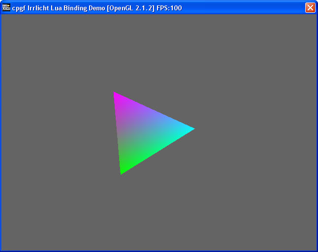
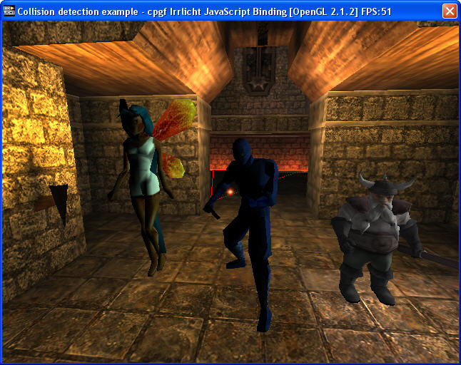
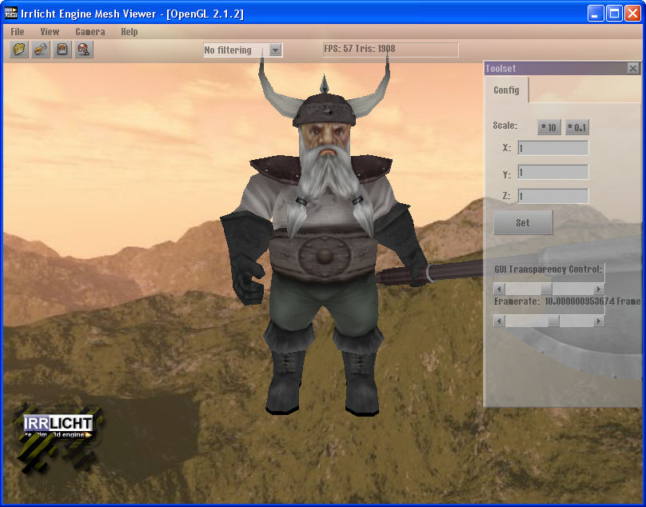
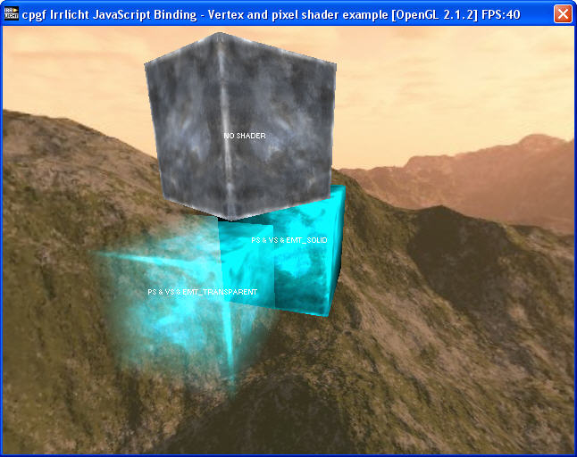
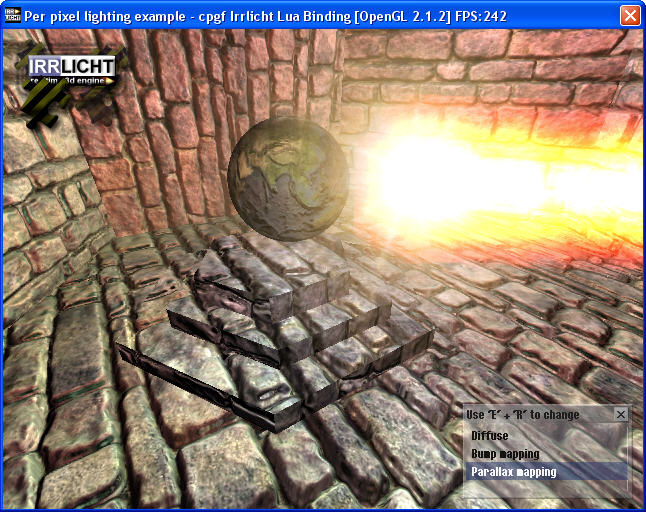
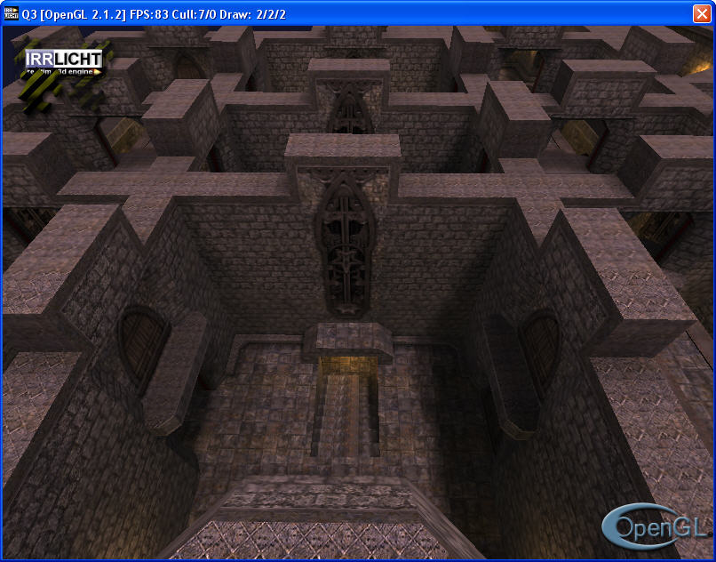

# cpgf reflection, Lua, Javascript, and Python script binding for Irrlicht 3D engine
<!--begintoc-->
* [Overview](#a2_1)
* [How is the meta data created](#a2_2)
* [Current status of Irrlicht reflection and script binding](#a2_3)
* [Compiling requirements of Irrlicht library](#a2_4)
* [Use cpgf Irrlicht script binding](#a2_5)
* [Compile and run Irrlicht sample script code](#a2_6)
* [Memory management in cpgf Irrlicht script binding](#a2_7)
* [Known issues and limitations in the Irrlicht meta data](#a2_8)
<!--endtoc-->

<a id="a2_1"></a>
## Overview

cpgf Irrlicht binding is a full stack of technology to use cpgf reflection and script binding with the 3D render engine Irrlicht. With cpgf built-in meta data collection for Irrlicht, we can easily get reflection information for Irrlicht at runtime, and it's even easier to use Irrlicht library in Lua, Google V8 JavaScript, and Python.

The supported Irrlicht version is 1.8.

<a id="a2_2"></a>
## How is the meta data created

All of the meta data for Irrlicht is generated automatically by the tool metagen, which is a part of cpgf library. No any bit was written by hand.

<a id="a2_3"></a>
## Current status of Irrlicht reflection and script binding

Thanking to the great sample code collection in Irrlicht C++ version, 19 out of total 26 samples are converted to Lua, JavaScript, and Python scripts. All of the 57 scripts (19 samples in 3 script languages) work perfectly.

The 19 samples code are 01.helloworld, 02.quake3map, 03.customscenenode, 04.movement, 05.userinterface, 06.2dgraphics, 07.collision, 08.specialfx, 09.meshviewer, 10.shaders, 11.perpixellighting, 12.terrainrendering, 13.rendertotexture, 15.loadirrfile, 16.quake3mapshader, 18.splitscreen, 19.mouseandjoystick, 23.smeshhandling, 26.occlusionquery

Below are screenshots of some sample code running in different script language.










<a id="a2_4"></a>
## Compiling requirements of Irrlicht library

The default distribution of Irrlicht disables RTTI. cpgf can work without RTTI in meta data. However, if we need to cast object to parent/child class in script binding, RTTI is required, otherwise cpgf.cast can't work.

Seems Irrlicht requires a lot of explicit type casting because a lot of functions return pointer with base classes. So to use Irrlicht in script binding, **we should recompile Irrlicht library with Run Time Type Information (RTTI) enabled**, otherwise, object can't be casted between classes.

<a id="a2_5"></a>
## Use cpgf Irrlicht script binding

To use Irrlicht meta data, add all cpp files in folder src/metadata/irrlicht/ to your C++ project. Compiling Irrlicht meta data is very slow. It needs from 20 minutes to one hour to compile, depending on your hardware and compiler.

All Irrlicht meta data is reflected in namespace irrlicht. Note there are sub namespaces in Irrlicht C++ version, meta data doesn't use any sub namespaces.

The sample code binds namespace irrlicht to irr, so the namespace in script code is irr.

To see how to bind the meta data, please see the sample code main file samples/irrlicht/sampleirrlicht.cpp

Below is the full source of Hello World sample JavaScript code
```javascript
function start()
{
    var device = new irr.createDevice(irr.EDT_SOFTWARE, new irr.dimension2d_u32(640, 480), 16, false, false, false, null);

    if (!device)
        return 1;

    device.setWindowCaption("Hello World! - cpgf Irrlicht Script Binding Demo");

    var driver = device.getVideoDriver();
    var smgr = device.getSceneManager();
    var guienv = device.getGUIEnvironment();

    guienv.addStaticText("Hello World! This is the Irrlicht Software renderer!", new irr.rect_s32(10,10,260,22), true);

    var mesh = smgr.getMesh("../../media/sydney.md2");
    
    if(!mesh)
    {
        device.drop();
        return 1;
    }
    
    var node = smgr.addAnimatedMeshSceneNode( mesh );

    if (node)
    {
        node.setMaterialFlag(irr.EMF_LIGHTING, false);
        node.setMD2Animation(irr.EMAT_STAND);
        node.setMaterialTexture( 0, driver.getTexture("../../media/sydney.bmp") );
    }


    smgr.addCameraSceneNode(null, new irr.vector3df(0,30,-40), new irr.vector3df(0,5,0));

    while(device.run())
    {
        driver.beginScene(true, true, new irr.SColor(255,100,101,140));

        smgr.drawAll();
        guienv.drawAll();

        driver.endScene();
    }

    device.drop();


    return 0;
}

start();
```

<a id="a2_6"></a>
## Compile and run Irrlicht sample script code

In command line, go to build folder, run
<code>
make mingw TARGET=sampleirrlicht
</code>
will build cpgf Irrlicht sample code using MinGW. To build using VC, replace "mingw" with "nmake". Replacing "mingw" with "linux" will build the sample on Linux using GCC.

For more information, please read the document "Build and use cpgf library".

To run the sample application, we need to go to bin/Win32-VisualStudio in Irrlicht source code, and run the application with a sample code script. Example,
<code>
FULL_PATH_TO_SAMPLE_EXECUTABLE\sampleirrlicht.exe FULL_PATH_TO_CPGF_HOME\samples\irrlicht\04.movement.js
</code>
This will run the script 04.movement.js.

All the sample scripts use the same folder structure as Irrlicht C++ version, which assumes the resources are in the folder ../../media. That's why we should invoke the sample program from Irrlicht bin folder.

Note for VC user, you must add flag /bigobj to compiler settings to compile Irrchlit meta data.

<a id="a2_7"></a>
## Memory management in cpgf Irrlicht script binding

As far as I understand, Irrlicht is based on reference count memory management. Also a lot of objects are created by factory functions, such as createOctreeTriangleSelector. To release any objects, just call IReferenceCounted::drop.

In cpgf Irrlicht binding, the thing is slightly different.

1, For objects that are created by class constructor (i.e, object = new SomeClass()), the script engine will garbage collect it, **you should not drop the object**. (Of course if you grab the object, you must drop it to keep the reference count balanced, but that's another thing.)

2, For objects that are created by factory functions, you must call object.drop() to release the ownership. This is exactly same as Irrlicht C++ version does. It's possible that adding GMetaRuleTransferOwnership policy to those factory functions to make them give up the ownership and let the script engine garbage collect it, however, two problems prevent me from doing that, A, I don't and will not known which functions should give up the ownership, B, Some Irrlicht internal objects don't perform grab/drop well, so arbitrary garbage collection on those kind of objects may cause crash.


<a id="a2_8"></a>
## Known issues and limitations in the Irrlicht meta data

There are some known issues and limitation in current meta data for Irrlicht. All issues can be overcome with some workaround. Below lists the issues and how to overcome them.

**1, Templates need to be instantiated explicitly.**

This is not a limitation in cpgf nor in Irrlicht. Template is a kind of compile mechanism, it's not a type, we can't use it at runtime from within script. To use a template in script, we must instantiate the type that we will use later.

For example. irr::vector3d is a template. To use it, we must specify the certain instantiations. The meta data has instantiations for vector3d<f32> (with the new name vector3df) and vector3d<s32> (name vector3di). So in script calling "new irr.vector3df()" is equivalent to call "new irr::vector3d<f32>()" in C++.

cpgf Irrlicht meta data has some predefined template instantiations. See file tools/metagen/metagen_irrlicht/config.irrlicht.js, the variable predefinedTemplateInstances
```javascript
predefinedTemplateInstances : [
    "dimension2d<u32>", "",
    "dimension2d<f32>", "",
    "dimension2d<u32>", "dimension2du",
    "dimension2d<f32>", "dimension2df",
    "dimension2d<s32>", "dimension2di",
    "rect<s32>", "",
    "vector3d<f32>", "vector3df",
    "vector3d<s32>", "vector3di",
    "line3d<f32>", "",
    "triangle3d<f32>", "triangle3df",
    "triangle3d<s32>", "triangle3di",
    "CMatrix4<f32>", "matrix4",
    "aabbox3d<f32>", "",
    "vector2d<s32>", "position2d_s32",
    "vector2d<s32>", "position2di",
    "vector2d<f32>", "position2d_f32",
    "vector2d<f32>", "position2df",
    "plane3d<f32>", "plane3df",
    "plane3d<s32>", "plane3di",
    "IIrrXMLReader<wchar_t, IReferenceCounted>", "IXMLReader",
    "IIrrXMLReader<c8, IReferenceCounted>", "IXMLReaderUTF8",

    "array<irr::scene::quake3::IEntity, irrAllocator<irr::scene::quake3::IEntity> >", "tQ3EntityList",
    "array<video::S3DVertex, irrAllocator<video::S3DVertex> >", "array_S3DVertex",
    "array<video::S3DVertex2TCoords, irrAllocator<video::S3DVertex2TCoords> >", "array_S3DVertex2TCoords",
    "array<scene::ISceneNode *, irrAllocator<scene::ISceneNode *> >", "array_ISceneNodePointer",
    "array<f32, irrAllocator<f32> >", "array_f32",
    "array<u16, irrAllocator<u16> >", "array_u16",

    "CMeshBuffer<video::S3DVertex>", "SMeshBuffer",
    "CMeshBuffer<video::S3DVertex2TCoords>", "SMeshBufferLightMap",
    "CMeshBuffer<video::S3DVertexTangents>", "SMeshBufferTangents",
]
```
Each line contains the C++ name and the mapped meta data name. If a meta data name is empty, it's mangled from the C++ name by replace all < and > with _, and remove all tailing underscores. So the first line, dimension2d<u32> will be given a meta name as dimension2d_u32.

So adding new instantiations by yourself is a piece of cake. Just add new names pair to the list and run metagen again.

**2, There are only several template instantiations for irr::array.**

Those types are instantiated to support the sample code.

Seems Irrlicht uses that array template a lot, but I have no idea which kind of types are most used with irr::array. So I didn't generate any more template instantiations for irr::array. I will appreciate if anyone can give a list of the types to be instantiated!

**3, More issues are awaiting for your Irrlicht experts to report!**

Please bear in mind, though I can generate meta data for Irrlicht, I personally have very few knowledge or experience on Irrlicht library and 3D programming. What I could do is just to convert its sample code literally and blindly to do some simple test. I don't know what's the potential issues in Irrlicht. So if you are experiential Irrlicht user or developer, please report any issues you find in cpgf.
