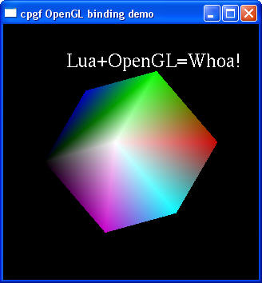
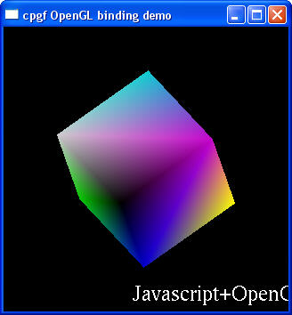

<!--notoc-->

# Built-in meta data for OpenGL, GLU and GLUT in C++ cpgf library

## Overview

The meta data for OpenGL is a collection of meta data to represent for OpenGL, GLU, and GLUT library.  
Now the supported OpenGL version is 1.2, GLUT version is 3.7.  
The reason that we support so low version OpenGL, is because of that I have very few experience with OpenGL and have difficulty to cover OpenGL from version 1 to 4.  
cpgf library itself is able to work with any version of OpenGL as long as meta data is added.

Some cool features in script binding with OpenGL:
  * Using OpenGL in Lua and Javascript is a piece of cake. The "opengl" sample in the library demonstrates how easy to use OpenGL in script.
  * Complete callback supports in GLUT. Scripts can pass the function written in script code to GLUT functions.
  * Complete binary data supports. Scripts can pass vertex buffer, color buffer, etc, to GL functions. 




Can't wait to experiment the OpenGL binding? Below is a piece of real Javascript code snippet that using OpenGL!  
To see more code, see samples/opengl/sampleopengl.cpp in the library package.
```javascript
function render()
{
    gl.glClear(gl.GL_COLOR_BUFFER_BIT + gl.GL_DEPTH_BUFFER_BIT + gl.GL_STENCIL_BUFFER_BIT)

    gl.glEnableClientState(gl.GL_VERTEX_ARRAY)
    gl.glEnableClientState(gl.GL_COLOR_ARRAY)
    gl.glEnableClientState(gl.GL_NORMAL_ARRAY)
    gl.glPushMatrix()
    gl.glTranslatef(translateX, translateY, 0)
    gl.glRotatef(rotate, 1, 0, 1)
    gl.glVertexPointer(3, gl.GL_FLOAT, 0, vertexList)
    gl.glColorPointer(3, gl.GL_FLOAT, 0, colorList)
    gl.glNormalPointer(gl.GL_FLOAT, 0, normalList)
    gl.glDrawElements(gl.GL_QUADS, 24, gl.GL_UNSIGNED_INT, indexList)
    gl.glPopMatrix()
    gl.glDisableClientState(gl.GL_VERTEX_ARRAY)
    gl.glDisableClientState(gl.GL_COLOR_ARRAY)
    gl.glDisableClientState(gl.GL_NORMAL_ARRAY)
    gl.glutSwapBuffers()
}
function reshape(w, h)
{
    gl.glViewport(0, 0, w, h)
    gl.glMatrixMode(gl.GL_MODELVIEW)
}
function keyboard(key, x, y)
{
    if(key == 27) exitDemo()
}
function timer(value)
{
    rotate = rotate + 1
    rotate = rotate % 360
    gl.glutPostRedisplay()
    gl.glutTimerFunc(value, timer, value)
}
function start()
{
    gl.glutInit()
    gl.glutInitDisplayMode(gl.GLUT_DEPTH + gl.GLUT_DOUBLE + gl.GLUT_RGB + gl.GLUT_STENCIL)
    gl.glutInitWindowPosition(200, 200)
    gl.glutInitWindowSize(320, 320)
    gl.glutCreateWindow("cpgf OpenGL binding demo")
    gl.glutDisplayFunc(render)
    gl.glutReshapeFunc(reshape)
    gl.glutKeyboardFunc(keyboard)
    period = 33
    gl.glutTimerFunc(period, timer, period)

    gl.glShadeModel(gl.GL_SMOOTH)
    gl.glHint(gl.GL_PERSPECTIVE_CORRECTION_HINT, gl.GL_NICEST)
    gl.glHint(gl.GL_LINE_SMOOTH_HINT, gl.GL_NICEST)
    gl.glHint(gl.GL_POLYGON_SMOOTH_HINT, gl.GL_NICEST)

    gl.glEnable(gl.GL_DEPTH_TEST)
    gl.glEnable(gl.GL_LIGHTING)
    gl.glEnable(gl.GL_TEXTURE_2D)
    gl.glEnable(gl.GL_CULL_FACE)

    gl.glColorMaterial(gl.GL_FRONT_AND_BACK, gl.GL_AMBIENT_AND_DIFFUSE)
    gl.glEnable(gl.GL_COLOR_MATERIAL)
    gl.glClearColor(0, 0, 0, 0)
    gl.glClearStencil(0)
    gl.glClearDepth(1.0)
    gl.glDepthFunc(gl.GL_LEQUAL)

    gl.glutMainLoop()
}
```

## APIs to build meta data

The meta data for each OpenGL library is in its own header file.  
The header files are in folder include/cpgf/metadata/opengl.  
gmetadata_opengl.h  
gmetadata_openglu.h  
gmetadata_openglut.h

Note: before include those header file, the corresponding OpenGL header file must be included first.  
So the code on Windows will look like:
```c++
#include <windows.h>
#include <gl/gl.h>
#include "cpgf/metadata/opengl/gmetadata_opengl.h"
```

Similar with GLU and GLUT.

The APIs prototype:
```c++
template <typename MetaDefine>
void buildMetaData_open_gl(const GMetaDataConfigFlags & config, MetaDefine define,
    const GMetaDataNameReplacer * replacer = NULL);

template <typename MetaDefine>
void buildMetaData_open_gl(MetaDefine define,
    const GMetaDataNameReplacer * replacer = NULL);


template <typename MetaDefine>
void buildMetaData_open_glu(const GMetaDataConfigFlags & config, MetaDefine define,
    const GMetaDataNameReplacer * replacer = NULL);

template <typename MetaDefine>
void buildMetaData_open_glu(MetaDefine define,
    const GMetaDataNameReplacer * replacer = NULL);


template <typename MetaDefine>
void buildMetaData_open_glut(const GMetaDataConfigFlags & config, MetaDefine define,
    const GMetaDataNameReplacer * replacer = NULL);

template <typename MetaDefine>
void buildMetaData_open_glut(MetaDefine define,
    const GMetaDataNameReplacer * replacer = NULL);
```

The parameters:

**config**: The config flags to control how to build meta data.  
The legal value for GL binding is either 0, or mdcScriptable.  
If it's mdcScriptable, the meta data will contain auxiliary functions to handle callback functions in GLUT library.  
Also a function createByteArray is bound to script so the script can create byte array to manipulate and pass binary data.  
Note: the counterpart API that doesn't have config, will always build meta data as if mdcScriptable is provided.

**define**: a meta define that represents the meta class.  
It can be obtained by GDefineMetaClass<T>::define or GDefineMetaClass<T>::declare.

**replacer**: a mechanism that allows to change the default function name in the meta data.  
Please read STL meta data document for details.
