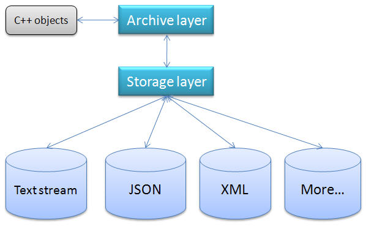

# Inside cpgf serialization -- core concepts and data types

<!--begintoc-->
* [Simple data types and compound data types](#a2_1)
* [Archive identifier](#a2_2)
* [Class type identifier](#a2_3)
* [Archive and Storage -- two layers structure](#a2_4)
* [Streaming storage and structured storage -- we support both](#a2_5)
* [Serializer -- the sharp sword to serialize arbitrary data types](#a2_6)
* [Customized storage and serializer -- extend serialization library infinitely](#a2_7)
* [Core data types in archive layer](#a2_8)
<!--endtoc-->

In this document, we will introduce the core concepts and data types in cpgf serialization library. It's important to understand these stuff if we want extend the serialization library. Yes, cpgf serialization library is extensible without modifying the source code.

## Simple data types and compound data types

Simple data types are null pointer and C++ fundamental types, such as integer, float, double, char, etc, which are the fundamental types in GVariant. Null pointer is a kind of type because of its special character -- an object pointer pointing to nothing.

Simple data is stored and retrieved in storage directly.

Compound data types are C++ objects (class and structure), array and string.

Compound data is tracked by pointers. Two objects sharing the same address will be stored and retrieved only once.

## Archive identifier

When serializing compound data, each data is given a unique 32 bits archive ID. If a data at the same address is serializing, the archive ID is stored instead of the object.

Archive ID is only used to track object pointers. So if we are sure there is no two objects at the same address, we can omit archive ID.

## Class type identifier

To be space and timing efficiency, cpgf serialization uses a 32 bits class type ID to represent a meta class, instead of a long string of meta class name.

Class type ID is only used for optimization purpose. It's not a must. Indeed it's exchangeable with meta class name, so we can omit class type ID if we want, e.g, when we design a human writable data format.

## Archive and Storage -- two layers structure

To get best flexibility and architecture, cpgf serialization library is separated into two independent layers, the archive layer and the storage layer. Each layer is accessed via reader and writer.

The archive layer is the core layer. We can't modify or extend it. The archive layer handles the high level meta data information. It parses meta data and transfer the data to storage layer.

IMetaArchiveReader and IMetaArchiveWriter are the core interfaces of archive layer.

The storage layer is the bridge between the archive layer and the physical storage such as a text stream in memory or an XML file on the disk. It's replaceable and extensible. The storage layer accepts data from the archive layer, then store the data into the physical storage, such as a node in an XML tree.

IMetaStorageReader and IMetaStorageWriter are the core interfaces of storage layer.

## Streaming storage and structured storage -- we support both

cpgf serialization library is designed to be data format agnostic. The archive layer doesn't assume anything on the data format. How the data format looks like is determined by the storage layer. More specific, the library supports both streaming storage and structured storage.

Currently there is one streaming storage, the text stream, and two structured storage, JSON and XML. It's not difficult to add new storage, no matter streaming or structured.

## Serializer -- the sharp sword to serialize arbitrary data types

Like the other part in cpgf library, the core serialization library is designed to be as minimal as possible. It even doesn't supports C++ string and array. Instead of bloating the core library with infinite data types such as string and array, the library uses a meta traits called IMetaSerializer to support arbitrary new data types.

If you go to the folder include/cpgf/metatraits in the source code, you may find C++ string and array serialization are implemented by the serializer.

With the powerful technology of serializer, we can support serializing any data types, such as C++ vector, list, containers from Boost library, etc.

## Customized storage and serializer -- extend serialization library infinitely

The customized storage and serializer are all we need to extend the serialization library to support any storage format and data types. We will have separated documentation to introduce how to implement your own storage and serializer.

## Core data types in archive layer

The archive layer supports several data types, all data are covered by those types. The types are defined in enum GMetaArchiveItemType.

  * matMissed: This is a dummy type and should not be stored. If a data is not found in the storage, the storage layer should return matMissed.
  * matNull: A null pointer.
  * matObject: An object. The object meta class must exist.
  * matReferenceObject: A reference to an existing object.
  * matClassType: A class type.
  * matFundamental: A fundamental type, such as integer, float, double, etc.
  * matCustomized: Customized data type. Currently C++ string and array are customized type.

